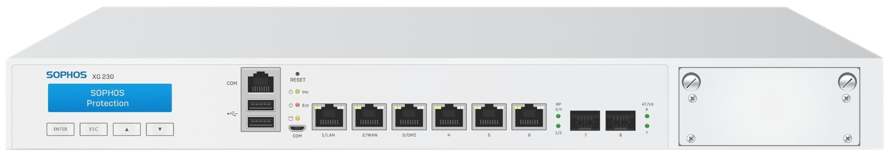

# Sophos XG230

Sophos XG Series rack format firewall. This series hardware reaches its EOL on March 31, 2025 so it is becoming cheap and a good chasis for certain applications.

[Sophos XG 230 Operating Instructions](https://docs.sophos.com/nsg/hardware/operatinginstructions/xg/sophos-operating-instructions-xg-210-rev3-230-rev2-oina.pdf)

## Mods

### Lower noise

For those of us that do not have a dedicated room for noisy devices and that do not expose them to huge amounts of heat, fan speed profile can be tuned to prevent noise on the lowest levels of fan speeds.

To do this, enter the BIOS setup by pressing `DEL` or `TAB` repeatedly after powering on the Sophos.

In the BIOS menu navigate to `Advanced`, `HW Monitor Status`, `Smart Fan Mode Configuration` and tweak the table to lower PWM output on the lowest temperature profiles.

### PFSense

With Sophos reaching EOL support for this devices, it may not make sense to keep the original Sophos software running.
A good alternative candidate is PFSense community edition.

The latest pfSense Community Edition installer can be downloaded from https://www.pfsense.org/download/ but the current installer requires Internet access.
If an offline install is needed, older ISO and memstick images are still available from community mirrors:

- https://repo.ialab.dsu.edu/pfsense/
- https://atxfiles.netgate.com/mirror/downloads/

From either source, download the **memstick** (USB) **amd64** (x86_64) image (for example `pfSense-CE-memstick-<version>-amd64.img.gz`).

To create the bootable USB stick decompress the `.gz` file and write the raw image to a USB stick of at least 2 GB:

- **Windows**: [Rufus](https://rufus.ie/) in _DD Image_ mode, or `balenaEtcher`.
- **Linux/macOS**: `dd if=pfSense-CE-memstick-<version>-amd64.img of=/dev/sdX bs=1M conv=sync`

Plug in the USB stick one of the USB ports.

Enter the BIOS setup by pressing `DEL` or `TAB` repeatedly after powering on the Sophos.

In the BIOS menu navigate to `Advanced`, `CSM Configuration`, `Boot option filter` and select `UEFI only` to enable UEFI boot mode.
Go to `Boot` and place `USB Key` to boot before `Hard Disk`.
Go to `Save & Exit` and press `Save Changes and Reset`.

The Sophos should boot from USB and you may proceed with the pfSense installer.

### pfSense LCD

To get the LCD working we need to install LCDproc in pfSense.
To install LCDproc, navigate to `System`, `Packages`.
On the Available Packages tab, search for lcdproc, then follow prompts to install it.

Once installation is complete, go to `Services`, `LCDproc` to configure the service.

Remember to check the `Enable LCDproc service` and select the following parameters for LCD configuration:

| Parameter       | Value                                    |
| --------------- | ---------------------------------------- |
| COM port        | Serial COM port 2 alternate (/dev/cuau1) |
| Display Size    | 2 rows 16 columns                        |
| Driver          | HD44780 and compatible                   |
| Connection type | Portwell EZIO-100 and EZIO-300           |
| Port speed      | Default                                  |

Press the save button and the LCD should be updated.
You may configure other settings following your preferences.
