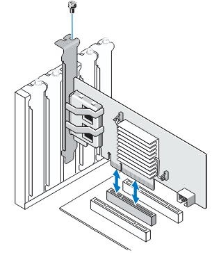
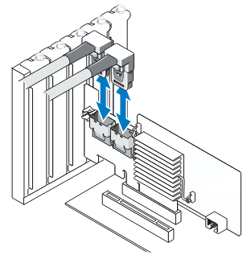
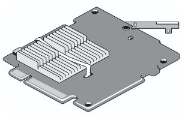

# Dell PERC H200

This is a very common controller among 11th generation Dell servers. Expect good integration with Rx10 and Tx10 models. It will not be as tightly integrated in newer generations.

[PERC H200 User's Guide](https://dl.dell.com/manuals/all-products/esuprt_ser_stor_net/esuprt_dell_adapters/poweredge-rc-h200_user's%20guide_en-us.pdf)

This controller comes in three variants.

| Model | Image                                 | Description                                   |
|-------|---------------------------------------|-----------------------------------------------|
| H200A |     | Standard variant with external connectors     |
| H200I |     | Integrated variant with internal connectors   |
| H200M |     | Modular variant                               |

## Modes

The card can operate in either in IR or IT modes.

By default, the card seems to ship an IR mode firmware and internet is full of tutorials on how to flash IT mode firmwares but before you start flashing, I would recommend you have a look at the following reddit thread:

[Another Dell H200 HBA Thread - To Flash or Not to Flash - IT vs IR](https://www.reddit.com/r/homelab/comments/a4nx6u/another_dell_h200_hba_thread_to_flash_or_not_to/)

## Frimware flashing

In case you decide to flash IT mode firmware:
* [Flash an H200 to IT mode w/ uefi & bios boot functionality](https://www.reddit.com/r/homelab/comments/8cjdz7/tutorial_flash_an_h200_to_it_mode_w_uefi_bios/)

In case you realize you want to go back to the stock firmware:
* [Revert your Perc H310 back to it’s Dell firmware - Coment on how to revert an H200](https://techmattr.wordpress.com/2014/06/13/revert-your-perc-h310-back-to-its-dell-firmware/comment-page-1/#comment-17249)

In case things go very badly, some general documentation:
* [Broadcom Sas2Flash Utility Quick Reference Ghide](https://docs.broadcom.com/doc/12353205)
